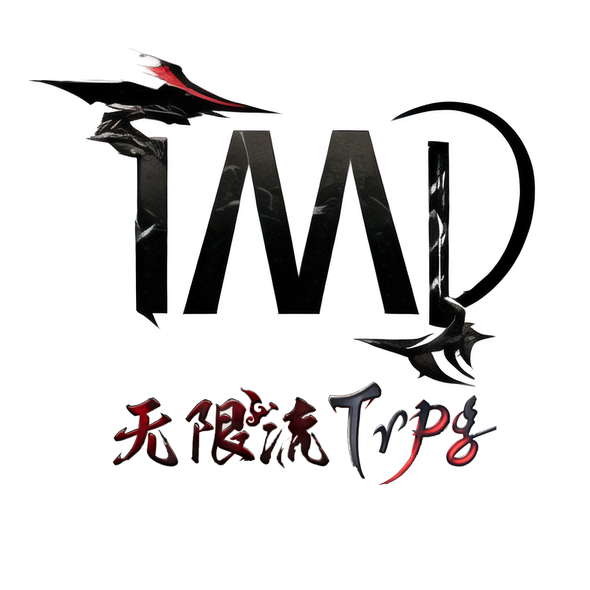

# 0.序言

<table class="bannerparthead"><tbody><tr id="hdr"><td class="runninghead" nowrap="">TMD：绯红庆典040</td></tr></tbody></table>

# 序言

  

版号宣 TMD：绯红庆典040

  
“在夜色中，我有三次受难：流浪、爱情、生存。”  
【晨昏飘摇】Tainted?Meridian（以下简称TMD）是基于无限恐怖FX的特性表开源、精确算写、数字运算的撰写基本理念。二度修整、重编大量基础规则内容而成的非传统无限流规则书。  
在此基础上，TMD的核心理念是不求盈利，永远革新，万事皆允。  
我们怀着重现黄金时代的心，以迎接末法时代。  
本书在游戏性层面的基本原则是造就更多差别公平，并给予玩家更多的游戏体验。从资源的理论强度上来讲，在短时间内没有更多投稿的情况下，应该会维持在一个稳定的平衡之中。当然，本书亦在起步状态中，如有兴趣，请联系我们。  
  
主创： 【魔术师】 【战车】 【死神】 【高塔】 【星星】  
技术指导： 【高塔】 【隐者】  
编撰人（以下排名不分先后）： 【倒吊人】 逆位【女祭司】 【隐者】 【恶魔】 逆位【恶魔】 逆位【星星】 【力量】 【恋人】 逆位【恋人】  
测试人员： 【权杖一】  
特殊贡献：【宝剑】  
非规则书技术支持：【星币】  
STG提供者：STG提供者：【圣杯】  
特别鸣谢：  
无限规则APP技术支持 残光  
大量资源提供者 鱼骨  
资源授权者 碧海  
资源授权者 生  
推广群：[TMD无限规则推广工厂](https://jq.qq.com/?_wv=1027&k=CCw2kbmw)  
交流群：[【汹涌疾风】无限流跑团交流群](https://qm.qq.com/q/xV81NX5M8E)  
[最新版本规则书下载](https://pan.quark.cn/s/2a308754f6a0)

* * *

     Copyright ? 2022 [TMDtrpg制作组](http://www.goddessfantasy.net/bbs/index.php?board=2008.0). All Rights Reserved.