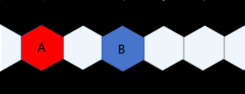

# 3.4.攻击方式及特殊动作

<table class="bannerparthead"><tbody><tr id="hdr"><td class="runninghead" nowrap="">TMD：勿忘尘002</td></tr></tbody></table>

# 攻击方式及特殊动作

  

攻击方式及特殊动作  
  
关于辅助专业：  
在本规则下，大部分攻击方式都获得了一种辅助专业，辅助专业意为在一次攻击中辅助角色进行攻击的特殊掌握技巧。例如敏捷-射击对应的辅助专业为学识-专业：弹道学。这些辅助专业只有专业等级会加入检定之中。此处只列举经常出现的攻击方式对应的辅助专业。施法对应的辅助专业为洞察-专业：能量感知或专注-专业：能量爆发（通常情况下为二者取一，特殊情况下选不重复的一种）。力量-武技对应的辅助专业为学识-专业：武学掌握。敏捷-射击/运动-投掷对应的辅助专业为学识-专业：弹道学。若购买的资源中有除此以外的新建攻击方式，则以其写明的辅助专业为准。

  
常用攻击方式：  
以天生武器进行一次肉搏攻击  
额定DP=力量属性+武技+专业：肉搏相关专业（例如拳、腿、掌）+专业：武学掌握+天生武器伤害（若有）+其他加值（若有）  
天生武器在未获得增益前只能造成冲击伤害，在能将造成的伤害从冲击伤害转化为严重伤害后，肉搏还将额外再造成等同于这次攻击的附加成功的冲击点数，强韧豁免

  
以近战武器进行一次近战攻击  
额定DP=力量属性+武技+专业：对应近战武器+专业：武学掌握+武器伤害+其他加值（若有）

  
以枪械/弓箭进行一次射击  
额定DP=敏捷属性+射击+专业：弓箭/对应枪械+专业：弹道学+武器伤害+其他加值（若有）  
特殊的，弓箭也可以使用力量进行检定，但仍使用弹道学为辅助专业

  
枪械武器标注的射程为通用射程，一般情况下，它意味着枪械武器能达到的基础射程。

  
以投掷进行一次掷击  
额定DP=敏捷/力量属性+运动+专业：投掷+专业：弹道学+武器伤害+其他加值（若有）  
投掷的取决属性分为力量和敏捷，轻型投掷物进行投掷时可以选择使用敏捷或力量进行检定，重型投掷物进行投掷时只能使用力量进行检定，若一个投掷武器没有进行声明，通常是轻投掷武器。投掷距离等同于检定属性\*5米，角色力量属性上的每点附加成功会额外提升10米射程。通常情况下，能投掷的物体大小需在人物体积-3之内，每超过1点就需要2点额外的力量。若投掷的物体超过人物体积2点及以上且人物体积高于4点，则投掷出的物体会额外具有【威猛5】；若投掷的物体体积不超过人物体积-3，可以选择额外消耗一个迅捷动作以增加物体出手的速度，投掷物的高速从高速1变为高速4  
  
临时武器  
临时武器代表单位仓促使用物品进行作战。  
人物可以将一个可以拿取的物品当作临时武器使用，此时按照物品的体积值判断力量需求。当一个物品被作为临时武器使用，这一物品无法发挥它本身的物品属性（例如：武器伤害、特殊效果等）。被用作临时武器的物品通常没有武器伤害，因此在以其进行攻击时只会造成冲击伤害。  
使用临时武器进行攻击的检定构成为：力量+武技+临时武器+辅助专业：武学掌握+其他加值。  
  
  
投掷单位  
仅在一个单位处于无助、定身、震慑、睡眠状态或是被擒抱所压制时，你可以将其以投掷规则当作物品一般进行投掷，若以此方式将一个单位进行投掷，则这次投掷攻击的射程会缩减至原先的一半，这次投掷进行的攻击行为会将被投掷单位一同作为攻击目标生效。

  
关于武器自带的高速：  
投掷类武器具有高速1  
弓箭/弩箭具有高速3  
枪械具有高速5  
高斯枪械具有高速8

  
关于武器伤害：  
进行攻击时，这次攻击中每具有3点武器伤害或法术强度（不足则向下取整），便会获得1点对应的破防，近战白刃武器为破甲、近战肉搏武器为威猛、远程武器为高速、法术强度为破魔。  
特殊的：穿戴在手部的肉搏武器若【仅】提供附加成功而不提供任何的武器伤害，则【武器本身】每提供有1点附加成功便获得1点威猛。

  
以载具进行一次攻击  
额定DP=智力+器用+专业：载具操作+专业：精密操作（属手艺）+载具自带武器伤害+其他加值（若有）  
载具一般情况下不能享受驾驶者的加值和能力，只能使用载具自带的武器进行攻击  
  
以载具进行一次碾压攻击  
碾压攻击的前提为载具的体积至少大于被攻击者体积2点及以上，它在通常情况下必须结合在一次移动中  
额定DP=智力+器用+专业：载具操作+专业：精密操作（属手艺）+载具高出被碾压者每点体积+其他加值（若有）  
碾压攻击通常情况下只造成冲击伤害，被碾压者需进行一次反射豁免对抗，并被载具撞出二者差值的米数

  
以法术进行一次攻击  
额定DP=智力+学识+专业：施法+专业：魔力爆发/魔力感知+法强（若有）+其他加值（若有）

  
以远程武器进行一次瞄准  
进行瞄准是一个花招动作，但无论瞄准者拥有多少个花招动作，都只能一轮瞄准一次。第一轮瞄准会获得1DP的瞄准加值，此后每一轮连续的瞄准都会在上一轮基础上额外获得1DP瞄准加值，但获得的瞄准加值上限为获得3DP。在一次攻击后，所有的瞄准次数就会清零。瞄准只能对瞄准者视距范围内的单位进行，被瞄准者必须能够被瞄准者模糊或精确定位。若人物在瞄准时移动则会丢失瞄准获得的好处。

  
全力攻击  
进行全力攻击至少需要一个标准动作，它并不会占用招式攻击，但无法结合在非标准动作进行的攻击及动作高于标准动作进行的攻击之中。它只能被近战应用，这次攻击将获得2点额外的DP，视为力量加值，并在那次攻击后再失去2点基础上的防御直至下一个该攻击者的回合开始

  
冲锋攻击  
进行冲锋攻击至少需要一个整轮动作，它本身就视为一种近战招式。冲锋攻击是由移动+攻击组成的，发动冲锋攻击者首先立即向冲锋目标进行一次冲锋，这段冲锋距离最多不能超过移动上限的2倍（若使用的是杂技动作进行冲锋，则不能超过3倍），在这段移动结束后，立即对该目标进行一次攻击（前提是可以攻击的到），此次攻击额外获得等同于这次冲锋距离的DP，但最多不能超过其拥有的基础防御数，这些DP视为表现加值，在那次攻击后，进行了冲锋攻击的单位在一轮内会失去等同于那些加值的基础防御。冲锋攻击的冲锋动作结束时，若已经不满足攻击条件或因冲锋道路上有其他阻碍而被迫停止冲锋，则冲锋攻击的攻击步骤将被取消。当你进行了冲锋攻击后，在当前回合你的移动距离减半。  
注：部分资源会提到冲锋有效距离，这一词条指的是冲锋攻击可获得最大为基础防御值的表现加值的这部分距离，一言蔽之，就是计算冲锋加值时的基础防御值（当然前提是你冲锋的距离没有近到吃不满这一减值）。

  
多次攻击减值  
一个单位若是在一轮内受到多次攻击，则从其第X+1次受到攻击开始，仅在面对这次攻击时，防御会按照以下顺序依次减少X点：格挡、闪避、基础。至多将防御减少至0。

  
全力防御  
全力防御是一种需以标准动作进行的防御方式，从开始全力防御后，进行全力防御的角色的基础防御翻倍、闪避防御增加一半（注：不包括基础防御在内的部分），且其基础防御即使被完全破穿，也会保留其上拥有的附加成功。进行全力防御时只能半速移动。这个效果将会持续至进行全力防御者的下个回合开始。

  
移动动作的防御方式：  
以下防御方式都由移动动作执行，一个单位只能同时享受一种方式进行防御的好处。若一个单位同时进行了多个防御方式，则仅有最后执行的防御方式会生效。  
  
寻求遮蔽与格挡  
格挡是一种近战生而具有的防御方式，消耗一个移动动作，获得等同于【武技等级+对应专业等级】/2的格挡防御（若使用的是杂技动作还会额外获得格挡所用专业等级一半的闪避防御）以及基于格挡防御的【格挡技能上附加成功】点封闭。若对应的格挡技能不存在附加成功时，则格挡时只能进行半速移动，但可以通过减少一半格挡带来的格挡防御进行全速移动。无论如何，一回合至多只能格挡一次。通过格挡获取的格挡防御将存在一轮。  
寻求遮蔽亦是一个需要消耗移动动作进行的动作，它的前提为寻求遮蔽者附近拥有遮蔽物，这种遮蔽物可以是任何能暂时为其提供掩护的东西（包括轮回者），根据遮蔽物的体积大小，会为其提供1-5遮蔽防御不等，但是否有额外效果，由ST决定。  

  
招架  
招架是一种所有轮回者与生俱来的防御方式，使用武器战斗（包括肉搏）的轮回者可以使用「运动」技能、不使用武器战斗的轮回者可以使用「专注」技能。  
招架需要使用者在自身回合中保留有至少一个可用于防御的移动动作，若如此做，那么使用者可以在回合外应对某次攻击时，可使用一个反射动作调用保留的移动动作进行一次招架，获得等同于招架对应技能等级的伤害出目抵消，在招架过一次攻击后，招架便自然失效  
  
紧急守护  
下令随从紧急守护是一个反射或迅捷动作，并再消耗一个移动动作（若在回合外使用，还需声明保有至少一个移动动作进行使用）。应对一次攻击，使用一个迅捷或反射动作，消耗一个额外的移动动作，立即命令随从回归到自身身边并为主人进行守护。这意味着随从至少要保有一个移动动作，且随从可以正常移动回其主人身周风度\*米数，才能正常生效。随从立即移动回符合生效范围的，由其主指定的一个位置，并会为此次攻击（若为回合内使用，则改为下一次）额外抵消等同于其主的风度/2点伤害出目，但相应的，这只随从也会同时受到抵消的这些伤害，不会计算其防御或豁免，但会正常计算伤害吸收。紧急守护是一个类招架行为。  
  
紧急规避  
以移动动作使用，直到你的下次行动开始前，你可以令载具获得在防御上获得相当于你【器用技能+专业等级】/2的闪避加值。每轮你只能进行一次紧急规避，在进行紧急规避时载具会同时位移等同载具体积\*0.5的距离。紧急规避是一个类招架行为。此能力可以在回合外以反射动作使用，但这需要你声明保留一个移动动作直到回合外。  
  
召还：召还是一个类招架行为，这需要你先具有一件正在回力状态中的武器，并保留一个移动动作至回合外，可以在应对一次攻击时立即消耗一个反射动作和保留的移动动作，将正处于回力状态中的武器召还回归，这个行为不会为使用者提供任何其他增益，而是对回力路径中的第一个目标或正攻击你的那个目标造成等同于应得伤害抵销数目的固定伤害，这些伤害不能被豁免，但可以被伤害吸收等方式吸收，与招架相同，进行过一次召还后立即失去召还状态，且那件武器将回归手中。  

  
  
  

  
伏地、下蹲  
通常情况下，伏地和下蹲均为一个移动动作。下蹲、伏地需要依托一个可进行掩护、可立足的平面进行。  
在伏地状态下，所有对于伏地的目标进行的近战攻击都会受到3DP的环境加值，而对于所有远程攻击而言，它们会更加困难的发现伏地的目标，伏地的角色从而获得3点遮蔽上的防御。在伏地状态下移动时，只能以通常移速的四分之一进行移动，伏地状态下不能进行招架或格挡。  
下蹲动作必须在已经处于主动寻求遮蔽成功的状态下进行，这将为其额外提供3点遮蔽上的防御，且其可以保留基础防御上的附加成功即使它被破穿。  
伏地状态下起身至少是一个移动动作，下蹲状态下起身是一个迅捷动作。伏地转换为下蹲状态是一个迅捷动作，下蹲转换为伏地状态也是如此。  
下蹲状态进行移动时，需以原速度一半的速度进行移动。

  
潜行  
潜行是一种特殊的行进方式，当你与敌方敏感范围进行侦测定位对抗后，若处于无法定位状态，则可选择进入潜行行走状态。潜行状态会导致以此法行走者移动速度减半，潜行者可以随时取消潜行行走状态，若如此做，则敏感范围内包含潜行者、具有相应感知方式的单位会获得潜行者的模糊定位。  
每轮开始时潜行者都需要与敏感范围内包含潜行者、具有相应感知方式的单位进行侦测定位对抗，若失败则会退出潜行状态，并承受定位对抗失败的后果。  
人物如果对其他单位处于可定位状态（模糊定位、精确定位），可花费一个移动动作进行一次半速移动以试图重新进入潜行状态，此时潜行者需要再度与敏感范围内包含潜行者的单位进行侦测定位对抗，若对抗成功则享受定位对抗成功的好处并进入潜行状态。  
在潜行行走的状态下，潜行者获得3点防御上的遮蔽加值，对无法定位潜行者的目标进行的攻击具有等于反侦测等级的措手不及。当潜行者进行攻击后，会脱离潜行状态。脱离潜行状态后，敏感范围内包含潜行者、具有相应感知方式的单位会获得潜行者的模糊定位。  
不能在保持伏地状态时进行潜行状态。  
如果一个单位具有潜行者的精确定位，则潜行者对于这一单位不处于潜行状态。  
注：潜行状态是潜行者对多个目标同时生效的状态，可能潜行者对于无法定位他的敌人A是潜行状态，对于可以精确定位他的敌人B是非潜行状态。但无论如何，潜行者脱离潜行状态一定是对所有敏感范围内包含潜行者的、具有相应感知方式的目标同时脱离潜行状态。

  
困难地形  
困难地形是指在行进过程中会延缓行进速度的特殊地形，通常会很难在这些地形上通过。在通过困难地形时，若没有相应的免疫能力，则会受到速度减半的减益直至完全通过那个区域

  
特殊攻击动作  
特殊攻击动作在基础意义上是一些能够转换或替代一次不附带任何招式的攻击的攻击方式。特殊攻击动作的使用都是建立在一次攻击的基础上

  
冲撞  
人物在进行近战攻击时可以额外花费一个移动动作，在这次攻击中结合一次冲撞，使用正常攻击进行检定，这次攻击命中后，被冲撞者需反射豁免或者强韧豁免进行对抗这次攻击的成功数，对抗失败者会被击退二者差值的米数。持有盾牌冲撞时，视为获得等同于盾牌体积/2的体积。进行冲撞检定时，某一方的体积每超过对方体积1点，就会额外获得1dp冲撞对抗上的增强加值，获得的加值上限不能超过防御方的体积值。  
非攻击类冲撞方式：人物可以一个移动动作选择一个触及范围内的单位，与对方进行一次【力量/敏捷】+【武技：盾/肉搏相关专业】/【运动：平衡】的检定对抗，对抗失败者会被击退二者差值的米数。持有盾牌冲撞时，视为获得等同于盾牌体积/2的体积。进行冲撞检定时，某一方的体积每超过对方体积1点，就会额外获得1dp冲撞对抗上的增强加值，获得的加值上限不能超过防御方的体积值。  

  
绊摔  
人物在进行近战攻击时可以额外花费一个移动动作，在这次攻击中结合一次绊摔，使用正常攻击进行检定，在攻击命中后，被绊摔者需进行反射豁免或者强韧豁免进行对抗这次攻击的成功数，被绊摔者失败则会进入伏地状态。进行绊摔检定时，某一方的体积每超过对方体积1点，就会额外获得1dp对抗上的增强加值，获得的加值上限不能超过防御方的体积值。  
非攻击类绊摔方式：人物可以一个移动动作选择一个触及范围内的单位，与对方进行一次【力量/敏捷】+【武技：肉搏相关专业】/【运动：平衡】的检定对抗，失败者会进入伏地状态。进行绊摔检定时，某一方的体积每超过对方体积1点，就会额外获得1dp对抗上的增强加值，获得的加值上限不能超过防御方的体积值。  
特殊的，具有飞行能力的单位在飞行时若被绊摔，则不会陷入倒地状态，而是在一轮内的飞行机动性下降一级。  
  
拖拽  
人物在进行肉搏攻击时可以额外花费一个移动动作并选择一个方向，在这次攻击中结合一次拖拽，使用正常攻击进行检定，在攻击命中后，被拖拽者需要进行一次反射豁免或者强韧检定对抗这次攻击的成功数，对抗失败则会被拖向选择方向失败值米。被拖拽者可以反射动作进行一次敏捷+运动+平衡检定，令自身被迫移动的距离减少成功数米。进行拖拽检定时，某一方的体积每超过对方体积1点，就会额外获得1dp对抗上的增强加值，获得的加值上限不能超过防御方的体积值。  
非攻击类拖拽方式：人物可以一个移动动作选择一个触及范围内的单位并选择一个方向，与对方进行一次【力量/敏捷】+【武技：肉搏相关专业】/【运动：平衡】的检定对抗，失败者会被拖向选择方向失败值米。进行拖拽检定时，某一方的体积每超过对方体积1点，就会额外获得1dp对抗上的增强加值，获得的加值上限不能超过防御方的体积值。

  
虚招  
你假意对目标进行攻击，欺骗性的让目标失去防御。  
你可以一个移动动作进行虚招。  
进行一次【智力+武技+对应武器专业检定+武学掌握】和目标的【感知+洞察+察言观色+武学掌握】检定进行对抗。  
目标如果失败，则会在一轮内陷入无支线级别措手不及状态，并失去3点格挡防御。目标失败后的一轮内进行招架时，所能抵挡的伤害减少一半。

  
擒抱  
将一次近战攻击转化为擒抱，共需以下几个步骤： 1、擒抱接触：你进行一次力量+武技+肉搏相关专业或敏捷+武技+肉搏相关专业的接触攻击检定，这次攻击不会造成伤害。如果你的天生武器适于抓住敌人（如牙咬、爪、触手、带倒钩的尾巴），你可以将天生武器的伤害值加入此次攻击判定中。如果你在这次接触攻击检定中取得了1个以上的成功数，这次接触攻击检定便被称为命中了。若无其他强化支持，玩家只能在空手或持有体积不大于你体积-3的物品时才能进行擒抱。进行擒抱接触检定时，某一方的体积每超过对方体积1点，就会额外获得1dp对抗上的增强加值，获得的加值上限不能超过防御方的体积值。   
2、擒抱对抗：若擒抱接触命中，你以一个自由动作进行力量+武技+肉搏相关专业，你的对手选择使用力量+武技+肉搏相关专业对抗以挣脱你，或者以敏捷+运动+反射专业对抗以逃脱。这个步骤称为擒抱对抗。进行擒抱对抗检定时，某一方的体积每超过对方体积1点，就会额外获得1dp对抗上的增强加值，获得的加值上限不能超过防御方的体积值。（需要注意的是，这一阶段通常而言不是一个攻击检定，也无法将武器伤害加入此检定）   
3、保持擒抱：若你在擒抱对抗中胜出，则你牢牢抓住对方，你们双方互相进入擒抱状态。当你们中的一人试图移动时，需要进行力量对抗，主动移动者每胜出1，则可带着对方移动1米，最多不得超过主动移动者的速度（注：如果一个具有传送移动的单位试图进行移动，则他也需要进行对抗成功后才可进行传送移动，且这次移动的距离仍然受到对抗胜出数的限制，但不会带着另一个擒抱者进行移动）。在这种状态下，你与对手对第三者的攻击都会失去基本防御，并且擒抱的失败方在攻击和格挡和需要肢体动作的特殊能力上受到相当于胜出方胜出数量的减值。擒抱状态视作一种类定身状态，可被免疫定身效果免疫。维持擒抱状态需要每轮花费一个移动动作或是本轮内主动对目标进行压制/攻击行为。  
  
攻击擒抱中的对手：你可以在擒抱状态下攻击擒抱中对手，但是你只能以天生武器或者体积不大于你体积-3的人造近战武器进行攻击。要攻击擒抱中的对手，你必须先发起一次擒抱对抗，并在对抗中胜出。接着，你可以以力量+武技+肉搏相关专业对对方发起攻击，每个成功数造成1点冲击伤害，即使你使用人造武器，也仍然使用肉搏相关专业进行判定，并且无论如何你都只能造成冲击伤害。这是一个整轮动作。  
解除擒抱：被擒抱者可以在自己的行动时以一个攻击动作主动进行“擒抱对抗”以试图摆脱擒抱。或者，发起擒抱的一方可以以自由动作解除双方的擒抱（包括压制）状态。特殊的，如果被擒抱者脱离了擒抱者的触及范围，则擒抱状态将无法维持而自动解除。  
压制对手：  
若你成功擒抱了一个目标，且你们二者还处于对彼此的擒抱状态，作为擒抱发起方，你可以一个标准动作试图压制对手，再次进行一次擒抱对抗，若你胜出数达到对方体积值，则对方进入“定身”状态，多次压制行为的成功数合并计算。你可以带着他以半速进行移动，此时你维持擒抱状态不再需要动作，其他情况如上所述。若你胜出的数量比对方的力量值更高，你可以利用对方的身体进行主动掩蔽。  
在压制状态下的角色若要脱离擒抱状态需要在解除擒抱中成功两次，一次摆脱压制，一次完全恢复自由。  
通常情况下，若擒抱双方体积差异不大，对一个目标维持擒抱需要占用两只手（即使你使用软兵器进行擒抱），即如果你有多个和手类似的肢体，可以同时对多个目标进行擒抱。  
某些软兵器可以用于擒抱，在这种情况下，以白刃相关专业代替肉搏相关专业进行判定（包括使用软兵器对被擒抱者进行攻击）。  
在压制状态下，压制的胜者可以以标准动作攻击被自己压制的目标，而无需进行擒抱对抗。   
当对擒抱中的对象使用远程单体的攻击时，如果不希望打中擒抱中的人，则在擒抱中的人数每有一个，就需要在攻击上-2DP，这个减值可以被减少攻击特定部位减值的能力所抵消。攻击者可以选择不承受这个减值，则处于擒抱中的所有人平分被该次攻击命中的概率，这一概率应视你们双方的体型差而有变化。  
  
  
攀附  
攀附通常是指一个单位试图以肢体将自身固定在另一单位身体上的行为。  
攀附对抗阶段  
进行攀附行为具有攀附者和被攀附者，攀附的发起者需要以一个标准动作对触及范围内体积大于或等于自身的单位（以下称为被攀附者，若被攀附者身上已经具有攀附者，则计算该单位体积时需要减去对方身上攀附者的体积）进行攀附，若被攀附者是非自愿单位，则攀附者需要进行一次力量/敏捷+运动+平衡检定以对抗被攀附者的反射豁免或者力量+武技+肉搏专业，被攀附者的体积每大于攀附者3点，被攀附者就在这一对抗检定中承受1点体积减值。  
若被攀附者胜出，则无法进行后续攀附流程。  
若攀附者胜出，则该攀附者将会在接下来的场景内进入攀附状态，被攀附者的移动速度将会减少攀附者体积\*3米。  
处于攀附状态的单位，其自身无法再进行主动移动且会被占据至少一侧上部肢体与两侧下部肢体（反之也可）的使用权。当被攀附者进行移动时，攀附者会跟随被攀附者进行移动。若被攀附者的移动为传送移动，则攀附者无法跟随其进行移动。  
维持攀附状态需要攀附者每轮花费一个移动动作，若无法支付，则攀附状态会在自身回合结束时解除。  
若被攀附者是非自愿单位，则可在自身进行移动时同时进行一次攀附对抗，若被攀附者胜出则可以解除攀附状态。  
若攀附者因其他原因（冲撞、拖拽等）使被攀附者脱离了自身的触及范围，则攀附状态也会被解除。

  
专注规则：  
专注是指在进行某项行为时，若注明需要保持专注，则一轮需支出一个对应动作的行动点数，若如此做，则可以维持某项行为的持续直至不想或无法维持专注为止。同一时间，你只能维持一项需要专注的能力。

  
脱离攻击范围  
当一个单位做出攻击宣言，令双方进入战斗结算流程后，防御方如果通过使用能力（如打断性移动、击退攻击者、逃入异空间等）离开了攻击者的攻击范围，防御方不会完全无效这次攻击，而是在计算防御的过程中将基础防御翻倍、闪避防御、格挡防御、器械防御将增加一半（这些同样不包括基础防御）计算；若这一攻击的形式是针对豁免，则这次豁免检定的成功数翻倍计算。

  
打断性能力  
具有打断性的动作生效时机是在一个动作正在进行时，比如对方进行一次攻击时、对方进行一次移动时。这意味着你无法在对方移动结束后，即将对你进行攻击前使用打断性能力离开对方攻击范围来令对方无法对你进行攻击。你需要在对方切实的对你进行了攻击，并在攻击结算流程中才能使用打断性能力。  
  
回合外进行的动作  
一个单位在回合外使用某项能力时，其不会影响对方（即处于自己回合的单位）如何进行自身的动作。比如轮回者A正在往目标B位置进行移动，此时目标B以反射动作往后进行移动，轮回者A在此时不会因为B的移动而无法改变移动的目标（即原先B所在位置），轮回者A仍然可以跟随B移动的方向正常进行移动。  
  
闯越  
  
闯越是指在某一单位被敌对或中立单位限制在某一无法正常移动或该单位主动进行的一种类移动行为。  
如图所示：  
  
当单位A希望越过敌对或中立单位B移动至其身后，此时左右两侧都无法正常移动，单位A就需对单位B进行闯越。  
进行闯越是一个类移动动作，这意味着需要至少消耗4AP，也可以选择使用一个杂技动作进行闯越，若如此做，则不会承受闯越的最差结果。  
主动阻挡行为：只有敌对或中立单位才会主动阻挡，相应的，轮回者也可以对这类单位进行主动阻挡，若满足闯越条件，则被阻挡者就需要闯越。试图主动阻挡是一个自由动作，无法在非自身回合进行闯越尝试。  
进行对有意识主动阻挡单位闯越的流程：  
1.闯越者以敏捷-运动-专业：反射检定进行闯越，阻挡者以敏捷/力量-运动-平衡进行对抗，双方体积差每有3点，较高者就增加1点闯越对抗检定上的附加成功，若双方体积差大于15点，则无法正常闯越或阻挡。  
2.根据出目决定此次闯越的距离  
闯越者大于阻挡者出目时，闯越者越过阻挡者，并移动一定距离，这个行为的总距离等于闯越者单个移动的距离；  
闯越者小于阻挡者出目，但大于阻挡者出目的二分之一，闯越者越过阻挡者，并移动一定距离，这个行为的总距离等于闯越者单个移动一半的距离；  
闯越者小于阻挡者出目，且小于阻挡者出目的二分之一，但大于阻挡者出目的四分之一，闯越者停在阻挡者面前；  
闯越者小于阻挡者出目，且小于阻挡者出目的四分之一，闯越者停在阻挡者面前，且阻挡者立即获得8点可以立即使用的AP响应这一闯越动作，在这一响应结束时立即消失，这个结果是最差结果  
只要有碰撞体积，就需要进行闯越，灵体与虚体在不会被影响的状态下不会被闯越限制，但也无法阻挡他人。  
  
进行对无意识非主动阻挡障碍物闯越的流程：  
1.确认该障碍物的体积，并确认翻越它所需的DC数，闯越者以敏捷-运动-专业：反射检定进行闯越，并将结果与障碍物的DC进行比较，双方体积差每有3点，较高者就增加1点闯越对抗检定上的附加成功（若障碍物较高则增加DC），若障碍物与闯越者间的体积差大于15点，则无法正常闯越或无需闯越。  
2.根据出目决定此次闯越的距离  
闯越者大于障碍物DC时，闯越者越过障碍物，并移动一定距离，这个行为的总距离等于闯越者单个移动的距离；  
闯越者小于障碍物DC，但大于障碍物DC的二分之一，闯越者越过障碍物，并移动一定距离，这个行为的总距离等于闯越者单个移动一半的距离；  
闯越者小于障碍物DC，且小于障碍物DC的二分之一时，闯越者将停留在障碍物上或障碍物前（由主持人决定）；  
闯越者小于障碍物DC，且小于障碍物DC的四分之一，闯越者将停留在障碍物上或障碍物前（由主持人决定），并失去剩余AP中的一半AP，这个结果是最差结果。

* * *

     Copyright ? 2023 [TMDtrpg制作组](http://www.goddessfantasy.net/bbs/index.php?board=2008.0). All Rights Reserved.