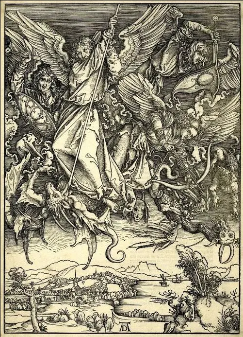

# 千禧骑士

<table class="bannerparthead"><tbody><tr id="hdr"><td class="runninghead" nowrap="">TMD：新秩序000</td></tr></tbody></table>

# 千禧骑士

  

千禧骑士  训练

_新千禧年，骑士们跃马扬鞭。_

千禧骑士

新千禧年，骑士们跃马扬鞭。  
无视过往，忽略将来，活在当下。  
  
老旧的显像管电视机里，循环播放着明艳到失真的蓝天白云与草地的风景。  
褪色发黄的墙纸上，黄色笑脸的涂鸦随着灼热的空气而微微抖动着。  
用铅笔重新卷好的磁带堆放在角落，一盘又一盘。  
  
咔哒。  
  
D级  
等级名称：忘却归途  
价格：D+600  
特性：【忘却归途】【梦力】  
效果：  
【忘却归途】  
下列效果中，每完成一项便可以获得一次忘却归途所对应的效果，当所有选项均被完成时，立即获得25点声望，每一项只能被完成一次。  
  
●外貌提升15  
●拥有一项千禧骑士武器及一项千禧骑士专长  
●经过一场影片  
●进行一次传奇扮演  
●在一场影片中，成为人尽皆知，口耳相传故事中的主人翁  
●首次打开基因锁  
  
【梦力】  
在完成第3项以外的选项时，第一次完成可以从风度+操纵/风度+沉着/操控+沉着中选择一种开启以这两种为主属性的能量池，这三种能量池被统称为梦力。  
梦力的恢复方式：  
1、每次长休息后恢复至满值。  
2、在与任意单位交谈半小时后会自动恢复1D6点，你在互动属性上每合计有两点传奇属性，就可额外投掷1D6来进行恢复。  
每日最多不能超过其上限的三倍。  
此后每完成一项除第三项外的选项会获得3点该能量池的上限。  
在获得梦力前，完成第3项不会视为提供任何效果，也不会视为完成，满足条件并完成后，会立即获得该能量池的6点上限。  
  
解锁梦力时，立刻在下列选项中获得一种新建攻击方式及梦力的基础用法，这一攻击方式需绑定以下三种方式之一进行使用：造成挥砍伤害的近战武器、弓箭、作为施法骰进行施法，在选定后不可更改。  
根据选择的梦力组合不同：  
风度+操纵被称为迷梦，其基础用法为：当仅进行一次以风度为主属性的检定时，可以选择消耗1点迷梦梦力，这次检定获得等同于传奇风度\*1的检定加值；迷梦的攻击检定构成为风度-社交-专业：摇篮曲-学识：心理学，这种攻击方式称为凝视。  
风度+沉着被称为幻梦，其基础用法为：当仅进行一次以沉着为主属性的检定时，可以选择消耗1点幻梦梦力，这次检定获得等同于传奇沉着\*1的检定加值；幻梦的攻击检定构成为沉着-隐秘-专业：进行曲-学识：心理学，这种攻击方式称为窥视。  
操控+沉着被称为无梦，其基础用法为：当仅进行一次以操控为主属性的检定时，可以选择消耗1点无梦梦力，这次检定获得等同于传奇操控\*1的检定加值；无梦的攻击检定构成为操控-洞察-专业：狂想曲-学识：心理学，这种攻击方式称为幻视。  
  
  
  
  
C级  
等级名称：创后应激  
价格：C+1200  
特性：【纷争】【万胜】【终末】 【不公】  
描述：  
海是鸟群的眼睛，  
大鱼枕着船漂流。  
撕开并穿过难愈疤痕后，  
一路梦到翡冷翠。  
  
购买此等级时立即选择一种四印，此后只能购买这种四印（这并不会让你获得该印）。  
购买该种印记的最低等级将额外花费4XP以唤醒印记的力量，若已拥有最低等级，则也需支付4XP，否则将封存该印的力量直至支付为止。  
若已获得了多项四印，则需放弃至只剩一项，其余以全额退款。  
与选择四印中不符的已拥有的印也需立即放弃，并以全额退款。  
  
【纷争】：  
And I pray they will be comforted by a power greater than any of us, spoken through the ages in Psalm 23:  
Even though I walk through the valley of the shadow of death, I fear no evil, for You are with me.  
  
【万胜】：  
Standing here today, I recall the wars of the president Franklin Delano Roosevelt, which are I think so good for this moment.  
  
【终末】 ：  
“Aureliano,” dijo tristemente en el manipulador,  
“está lloviendo en Macondo.”  
  
【不公】：  
Your blockade does not frighten me, because Colombia is not only a beautiful country—it is the heart of the world.  
  
效果：  
购买此等级时立即选择一种四印，此后只能购买这种四印（这并不会让你获得该印）。  
购买该种印记的最低等级将额外花费4XP以唤醒印记的力量，若已拥有最低等级，则也需支付4XP，否则将封存该印的力量直至支付为止。  
若已获得了多项四印，则需放弃至只剩一项，其余以全额退款。  
与选择四印中不符的已拥有的印也需立即放弃，并以全额退款。  
  
【纷争】  
现在，当你使用【业】时，你将获得如下效果：  
●当持印者赢得至少一次战斗以后，若这场战斗直接导致了影片中一方或数方势力（除非天启存在，否则纷争骑士所属的一方无论如何也不可被判定为势力）的实力强弱出现变更（即一方势力衰弱/一方势力增长），则纷争骑士在本影片中的社交检定上获得【操纵/2点】士气加值，这一效果将替换纷争之印D级的原有效果，若未持有纷争之印，则此能力暂时封存直至持有为止。  
●每轮一次，当你受到一次攻击时，你可以反射动作立即进行一次风度+表达+专业：舞蹈的检定，并选择任意方向，向那个方向移动等量距离，视为具有打断性。你将可以自由选择每次攻击是否消耗银色铭文。  
  
【万胜】  
现在，当你使用【渎圣】时，你将获得如下效果：  
●持印者在不违反三戒的情况下赢得至少一场战斗，便在本影片的社交检定中获得【风度/2点】表现加值，这一效果将替换万胜之印D级的原有效果，若未持有万胜之印，则此能力暂时封存直至持有为止。  
●每轮进行的首次【处刑】将不会再消耗花招动作。每场战斗中首次以【处刑】而杀死一名敌人时，立即获得等同于千禧骑士内在支线等级的AP（C1B2A3S4），这些AP仅能用于使用【渎圣】的下属能力，这些Ap在使用后场景内无法刷新。  
  
【终末】  
现在，当你使用【生之欲】时，你将获得如下效果：  
●持印者在全豁免上获得传奇沉着\*2点亵渎加值，如果持印者第二次进行的豁免类型与上一次进行豁免的类型相同（强韧、意志、反射），则本称号给予的豁免加值翻倍计算。这一效果将加入【终末之印】原有的效果中。  
●现在，当你制造出一具【天启仆从】时，若其力量属性不足11，则提升为11。当因第六刻印：野兽的效果而将其提升至11点及以上时，这一能力将失效，并立即获得2次【天启仆从】强化机会。  
  
【不公】  
现在，当你使用【无休盛宴】时，你将获得如下效果：  
●【不公之印】的最高等级将无法再超过千禧骑士的内在支线等级。对于每个等级而言，持印者总是被视为与其战斗的敌人的攻击检定DP相等，这一能力只会影响【不公之印】。  
●现在，当【无休盛宴】的天平在结算时若处于偏斜状态，可以选择1项未获得的D级食物放于一端，它将在本次攻击中立即生效。  
现在，当【无休盛宴】两侧的材料质量相等时，其上盛放的所有材料视为同时处于较沉一方，这会令这些材料的效果按描述生效。  
  
  
B级  
等级名称： 盛宴将歇  
价格：B+2400  
特性：【瘟疫】【战争】【饥荒】【死亡】  
描述：  
  
【瘟疫】：  
我就观看，见有一匹白马，骑在马上的拿着弓。并有冠冕赐给他。他便出来，胜了又要胜。  
  
【战争】：  
就另有一匹马出来，是红的。有权柄给了那骑马的，可以从地上夺去太平，使人彼此相杀。又有一把大刀赐给他。  
  
【饥荒】：  
我就观看，见有一匹黑马。骑在马上的手里拿着天平。我听见在四活物中，似乎有声音说，一钱银子买一升麦子，一钱银子买三升大麦。油和酒不可糟蹋。  
  
【死亡】：  
我就观看，见有一匹惨绿色马。骑在马上的，名字叫做“死亡”。阴府也随着他。  
效果：  
  
【瘟疫】  
现在，你进行的窥视/凝视/幻视攻击检定将额外具有【幻灭】。  
  
【战争】  
现在，你在进行窥视/凝视/幻视攻击检定将可以将伤害出目等量转化为魅惑点数/沮丧点数/恐惧点数，使用标准形式豁免。  
  
【饥荒】  
当你使用梦力参与攻击检定时，可以再额外支付1点，那次攻击将改为对方使用意志豁免抵抗。  
  
【死亡】  
当你进行窥视/凝视/幻视攻击检定时，你可以获得等同于风度/操控/沉着三种属性中的一种属性的传奇属性点的附加成功加入此次攻击，获得此等级时选择其中一种。  
  
  
A级  
等级名称：审判日  
价格：A+4800  
特性：【止戈】【天启】【审判】  
描述：  
Freude sch?ner G?tterfunken,  
欢乐女神圣洁美丽  
Tochter aus Elisium!  
灿烂光芒照大地！  
Wir betreten Feuer trunken,  
我们心中充满热情  
Himmlische, dein Heiligthum!  
来到你的圣殿里！  
deine Zauber binden wieder,  
你的力量能使人们  
Was die Mode streng getheilt,  
消除一切分歧，  
alle Menschen werden Brüder  
在你光辉照耀下  
wo dein sanfter Flügel weilt.  
四海之内皆兄弟。  
  
\*沙沙的磁带声\*  
这并非审判的开始，也不是审判的结束，不是开始的结束，连结束的开始也谈不上。  
审判自己的只能是自己。  
在新的千年，骑士们昂首向前。  
  
效果：  
  
【止戈】  
能耗：5点  
成分：言语、姿势  
动作：见具体叙述  
射程：0  
范围：当前场景  
持续：永久  
对抗：意志  
一场影片只能使用一次。  
这项能力需要以至少7轮时间准备。在准备结束后，整轮动作进行一次窥视/凝视/幻视攻击检定检定。这次攻击检定将立即对作用范围内除自身外的无支线等级及以下生物释放，使它们进入前所未有的宁静且渴望和平的状态之中。它们必须以意志豁免对抗这个出目，若对抗失败，则它们将被和平涤荡心灵，他们会放弃相互征伐杀戮，握手言和。这是一个A级心灵来源的沮丧效果。  
  
  
【天启】  
能耗：5点  
成分：言语、姿势  
动作：见具体叙述  
射程：0  
范围：当前场景  
持续：永久  
对抗：意志  
一场影片只能使用一次。  
这项能力需要以至少7轮时间准备。在准备结束后，整轮动作进行一次窥视/凝视/幻视攻击检定检定，这次检定将立即对作用范围内除自身外的无支线等级及以下生物释放，使它们受四印感召，自愿身作天启到来的先锋。它们必须以意志豁免对抗这个出目，若对抗失败，则它们将被转化为未获得过任何加强的天启先锋，且不能触发任何与天启先锋有关的效果。这是一个A级心灵来源的支配效果。  
  
  
【审判】  
任何受到由你造成伤害的目标都需要进行一个意志豁免，DC为攻击成功数。如果失败，其会陷入对由你指定的一个目标的【绝对仇恨】状态，处于【绝对仇恨】状态下的目标将不顾一切的使用一切手段杀死你指定的那个目标，并只能使用单体攻击方式。这是一个A级别心灵来源的胁迫效果。目标每轮都需要与你进行意志对抗，成功即可脱离【绝对仇恨】状态  
如果目标在【绝对仇恨】状态下连续三轮都无法对其造成其生命值总额的严重伤害，那么其心智将被宛如末日的绝望所压垮，这时目标将不再试图对其进行攻击，而是转为对你的【屈从】。天启可以对【屈从】状态下的目标下达一个指令，这个指令必须是明确的、可执行的。处于【屈从】状态下的目标必须执行这个指令，即使是杀死自己。这是一个A级别命运来源的支配效果。  
  

* * *      Copyright © 2022 [TMDtrpg制作组](http://www.goddessfantasy.net/bbs/index.php?board=2008.0). All Rights Reserved.