# 10.计算器教程alpha

# 序言

为了世界的公平与正义，巴拉巴拉，总之我将使用以下资源作为范例，重复制作该资源的流程来讲解规则书中提供的计算器（主要是STG→趁手工具→【撰写通用计算工具】）如何使用使用。需要注意的是，该资源因为要作为范例，因而使用了生硬的买法，虽然数据上没有问题，但实际上因为画风等原因无法通过审核，因此在任何团中都不应该将该范例作为可购买资源。

范例：

护身剑

C+1000

金色手柄妆点着紫色纹路，与华丽的外表对应的是其魔幻的力量。

长剑 11L 破甲1 挥砍 体积3

光之解放：仅限在白天，使用者可以支付1点意志力使用一个整轮动作在当前场景中解放这柄剑的力量，选择以下两种模式之一的能力获得，此外，每此自己的回合一次，可以用自由动作切换模式。

守护模式：守护模式下护身剑着重与对你进行保护，你在防御上获得3点力场防御，剑的守护会因为力量愈发强大，在携带这把剑经历了4次影片后，守护模式下的你可以免疫一半的穿刺物理伤害。

进攻模式：进攻模式下剑可以自由延展，使用这把武器时触及范围额外提升智力M，并在攻击时获得4点附加成功。

# 预先设计与画风描述

TMD是一个更看重画风的规则，因此我建议在进行撰写前想好制作的资源应该是怎样的画风，再根据画风推导出应该实现怎样的效果。

然后要注意画风表现的描述，多花一些时间与笔墨来描述这个东西的外形以及使用时的特效之类的。画风比强度更重要，至少在TMD是这样的。

# 可用DP计算

在购买效果前你需要计算自己有多少DP用于购买资源。模板、动作、持续时间、能量、限制，这些决定了DP数量。

## 1、选择模板

首先根据你的资源类型选择好模板，在使用【撰写通用计算工具】时只需要在以下两个复选框中选择就行了。

如图所示，范例资源是一把C级武器，所以支线等级选择C级，模板类型选择武器。

特别的，武器、盔甲、载具和随从等模板除了提供用于购买的DP，还会提供一些基础的效果，这也是范例资源选择武器模板的原因。武器与防具具有基础模板，首先在 资源分区→物品与装备→现实 中找到对应现实武器作为基础模板，范例资源是一把长剑，所以使用轻剑模板

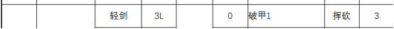

根据 撰写相关→模板与特性位 中武器模板的相关描述，C级武器还会额外提供8点武器伤害，所以范例资源由于模板获得了以下初始性能：

11L 破甲1 挥砍 体积3

虽然实际上大部分模板的资源在制作时只需要在通用计算器里之前提到的两个复选框选择模板就行了，但无论你要制作的是什么类型的资源，尤其是制作武器、盔甲、载具和随从这三类资源，我都建议在此步骤时查看 撰写相关→模板与特性位 。

## 2、选择动作

范例资源的效果需要一个整轮动作才能激活，因此

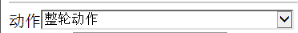

如图所示，在【撰写通用计算工具】中的动作复选框选择整轮动作即可。动作是一个特殊的选项，动作在决定DP数量的同时还会决定【指标】，这是TMD规则中制作资源时极为重要的一部分，我会在计算完DP后进行讲解。

想要了解动作在计算中是如何提升DP的，请查看 撰写相关→基础、动作、限制与能量 。

实际上，存在将一个资源的一部分用于购买被动效果，一个资源的一部分用于购买需要动作施展的效果这样比较复杂的买法，这是【撰写通用计算工具】无法处理，应当用【特性计算工具】处理的买法，这种买法应当如何计算DP，需要仔细查看 撰写相关→基础、动作、限制与能量 。

## 3、选择持续时间

范例资源的效果是一个持续一个场景的效果，因此

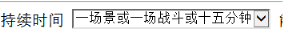

如图所示，只要在相应的复选框进行选择就行了，持续时间不像动作会牵扯其他复杂的规则，但是持续时间对于可用DP的影响比较大，会影响其他方法提供的DP。

想要了解持续时间在计算中是如何影响DP的，请查看 撰写相关→基础、动作、限制与能量 。

## 4、填入能量

能量的规则相对简单。消耗多少点能量就填入多少，如果使用的是意志力，则是消耗X点意志力就填入3\*X，没有则不填。

一个资源的能量消耗是有上限的，一般来说

能量消耗上限是D2 C6 B10 A14 S18

意志力消耗上限是D1 C2 B3 A4 S5

范例资源是C级资源，所以至多消耗6能量或2意志力。

范例资源使用了1意志力，1\*3=3，因此

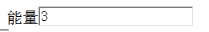

如图所示，在相应输入框中输入3即可

能量的规则相对简单，建议在 撰写相关→基础、动作、限制与能量 中查看相关规则。

## 5、填入限制难权

范例资源的效果有着只能在白天使用的限制，因此具有0.5的限制难权，因此

如图所示，在相应的地方填入即可，没有则不填，一个限制能获得多少难权，可以根据 撰写相关→基础、动作、限制与能量 中的相关描述初步推算，但实际的具体数值请向撰写组中的相关人士进行询问。

## 6、计算

执行完以上步骤后

点击该按钮即可看到

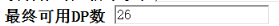

最终可用DP为26.

# 资源最终指标

在动作中我提到过，动作会决定【指标】，并且这是TMD规则中制作资源时极为重要的一部分。指标由两个东西决定，其一是模板。

根据模板等级，模板初始具有的基础指标为D2 C4 B8 A16 S32，可以发现，每一级的基础指标都是上一级的两倍。 撰写相关→通用特性表 中特性的购买需要满足指标的限制。举个例子：

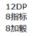

如图所示，8加骰这个特性需要具有8指标才能花费12DP进行购买（指标不会消耗，相当于一张代表允许购买的权限的VIP卡），所以一般情况下，需要B级模板才能购买该特性，C级模板的资源即使有足够的DP也不被允许获得8加骰。

但做到这一步的你或许已经发现了，

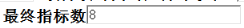

C级模板的基础指标应当为4，而【撰写通用计算工具】却显示范例资源的最终指标数是8，这意味着虽然范例资源是一个C级资源，但的确可以购买8加骰这个效果，这就是动作的作用，从移动动作开始，在获得额外DP的同时也会将一定数量的DP转换为指标，你不能拒绝将DP转换为指标，也不能将更多的DP转换为指标。动作最多只能将指标提升至原本的两倍，而每一级模板的基础指标都是上一级模板的两倍，也就是说动作只能将模板的指标提升一级，可以让D级买到C级特性，但不能让D级买到B级特性。根据我的经验，使用标准动作与移动动作（完全消耗）及其以上的动作就足够让指标升到下一级了。

如果想要具体的了解动作是如何对指标产生影响的，请在 撰写相关→基础、动作、限制与能量 中查看相关规则。

# 阶段小结

目前，我们可以计算出，护身剑 具有：

11L 破甲1 挥砍 体积3，26DP，8指标。

接下来需要讲解的就是如何使用这26DP来购买效果了。

首先，我们暂时不去考虑模式切换，将这把武器看作单纯的具有以下四个效果：

1.你在防御上获得3点力场防御

2.攻击时获得4点附加成功。

3.经历了4次影片后，守护模式下的你可以免疫一半的穿刺物理伤害。

4.触及范围额外提升智力M

接下来我讲依次讲解这四个效果的购买方式。

# DP转换（3税1）对应【转换效果】

1.你在防御上获得3点力场防御

打开 撰写相关→DP转换 ，你会发现这个页面被分割线分割成了三块，你能在第一块区域发现该效果，这意味着如果直接购买该效果需要按照3税1的方式交税。

根据1DP=1任意类型的防御可知这个效果花费3DP，那么将3填入转换效果1中再点击计算按钮。

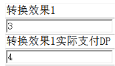

如图所示，你会发现虽然是3DP的效果，实际支付DP却需要4DP，为什么？这就是第一类DP转换税3税1，在第一块区域的效果，如果直接购买，每3DP就要交1DP作为税收走，如果是2点力场防御，花费2DP即可，但3力场防御则需要花费4DP。不过不同效果之间是分别计算的，例如你可以花费4DP来获得2力场防御和2攻击上的士气加值。

# DP转换（单特税）对应【轻转换效果】

2.攻击时获得4点附加成功。

打开 撰写相关→DP转换 ，你会发现这个页面被分割线分割成了三块，你能在第二块区域发现该效果，这意味着直接购买该效果需要用另一种方式交税，即单特税。

根据 3DP=1附加成功，所以4\*3=12，这个效果需要12DP才能购买。

之后在通用计算器中查看同级一特对应的DP数

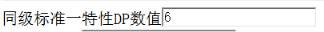

如图所示，C级1特的DP数为6，所以每在这个效果上花费了6DP就要支付1DP作为税，看起来3税1有些相似，那么12/6=2，12+2=14，所以要支付14DP，是这样吗？我们将其填入轻转换效果1中后点击计算按钮再看看。

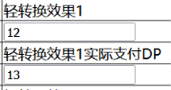

如图所示，你会发现实际支付DP并不是14，而是13，这是为什么呢？其实一般情况下，确实应当缴纳14，但这个范例资源中却有一个特别之处，因为使用了整轮动作，这个资源的指标数通过动作达到了下一级的指标，这导致该资源的单特税应当使用下一级的单特，B级1特的DP数为12，所以正确的计算方式是12/12=1，12+1=13。?????????????

# 成长效果（一）

3.经历了4次影片后，守护模式下的你可以免疫一半的穿刺物理伤害。

首先不去管4次影片这样的话，单看免疫一半的穿刺物理伤害这半句，打开 撰写相关→通用特性表 ，你可以在24DP 16指标的部分找到相应的特性“A级：免疫一种类型伤害的一半伤害”，16指标代表这是一个A级特性。这时你或许注意到了，之前我说过，购买通用特性表的特性需要足够的指标作为门票来购买，而范例资源的最终指标是8，并没有达到16，为什么能购买A级特性呢？这时就要将注意力放回“经历4次影片”上了，这代表这是一种成长的效果，而通过成长最高可以成长出指标两倍于最终指标的特性，也就是说，通过成长可以超过指标一级地购买特性。通过动作与成长，一个C级资源可以获得A级的特性，这就是极限了。

那么什么是成长？又如何计算成长效果的价格呢？

首先，什么是成长效果。成长是一种只购买1次，花费XDP购买；之后随着且仅随着你的属性/技能/训练等级/甚至购买东西的数量/经历的影片的数量成长获得收益的效果。成长主要分为两大类，在此我讲解这个效果使用的这类成长的计算方式。

打开 STG→趁手工具→【成长性计算器】或者【成长计算器改】 后者是因为前者在手机上不能使用，略微修改的版本，尚在测试中。无论你打开哪一个，你都能看到：

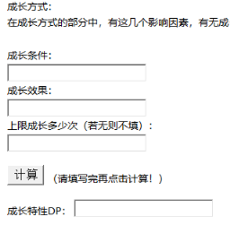

如上图所示，你需要填入三个数字，成长条件、成长效果、成长次数

成长条件：

通过查阅 撰写相关→成长性能力 中 成长条件 的部分 ，可以得知在成长效果不会因为更换影片而清空的成长，一场影片视为数值25的成长条件，四次影片，也就是25\*4=100，可知成长条件应为100

成长效果：

“A级：免疫一种类型伤害的一半伤害”是一个A级24DP 16指标的效果，直接购买的话需要24DP，因此成长效果为24

成长次数：

只会获得一次效果，自然成长次数是1

将以上三个数字填入，之后点击计算，你会看到

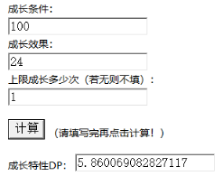

这意味着这个效果需要5.860069082827117DP购买，约等于5.86。

如果想要了解此类成长应该如果得出成长条件，建议查看 撰写相关→成长性能力 。

# 成长效果（二）

4.触及范围额外提升智力M

这是另一种类型的成长效果，需要使用另一种计算方式。

首先查看 撰写相关→成长性能力 ，在开头提供了各级预期属性，一般情况下都是以主属性进行计算，主属性就是玩家着力加点的属性，在制作资源时我们不知道使用这个资源的会是主要点什么属性的卡，所以我们以上限，也就是以智力为主属性的情况进行计算，一般“两种属性的较低者”之类的才会用到副属性的数据。根据预计属性，D级时智力6，C级时智力11，B级时智力16，A级时智力21，S级时智力26，对应的，该效果在D级会提供6M射程，C级会提供11M射程，B级会提供16M射程，A级会提供21M射程，S级会提供26M射程。

接下来我们将射程转换为DP，请查看 撰写相关→DP转换 的第三部分，

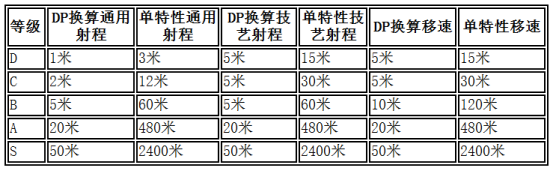

射程的购买不需要交税，其中技艺射程适用于3DP新建的攻击，属于这个效果的射程应购买通用射程。需要注意的是，在购买射程时，即使通过动作将指标提升到了下一级，仍按照原本的模板等级购买，所以应该是1DP=2M

因此，我们将射程转换为DP后，可知D级时的收益价值3DP，C级5.5DP，B级8DP，A级10.5DP，S级13DP。求平均数（可以使用平均数计算器）（3+5.5+8+10.5+13）/5=8，可知该效果的价格是8DP。

稍微延伸一下，“攻击上获得智力附加成功数的士气加值”，这样一个效果应该如何计算呢？按照之前提供的预期属性，可以计算出D级时预期收益1DP，C级时2，B3，A4，S5。取平均数，1+2+3+4+5/5=3，所以价格是3DP，进行这样一个延伸是为了说明一点，DP转换中的第一块与第二块中的效果，如果直接购买需要缴纳3税1或者单特税，但如果使用成长方式（两类成长方式均可）进行购买，则不用缴税。这是TMD撰写极为重要的技巧。

通过成长或其他方式购买到的并非简单直接地购买的特性在使用【撰写通用计算工具】时向这样将算出的数值像这样直接分别填入非标准单特性效果即可

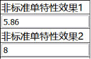

# 标准单特性效果

标准单特性效果比较简单，所以范例中没有使用，简单来说就是直接从 撰写相关→通用特性表 中购买的效果。举例来说，“使用该武器攻击具有8加骰”，这样简单直接的效果，8加骰是一个12DP 8指标的特性，也就是说是一个B特。

直接在标准单特性效果中选择B即可，记得点击计算按钮。

如图所示

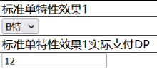

# 多方面

到现在，范例资源的四个效果与价格我们都已经知道了，回顾一下就是：

1.你在防御上获得3点力场防御

价格：4

2.  攻击时获得4点附加成功。

价格：13

3.经历了4次影片后，守护模式下的你可以免疫一半的穿刺物理伤害。

价格：5.86

4.触及范围额外提升智力M

价格：8

将这四个效果直接填入，你会发现

这时DP已经透支了。不过我们的制作还差最后一步，就是多方面的计算

多方面的不同方面的效果绝不能在同时、同一检定中生效。

范例资源的效果实际上被分成了两个部分

守护模式：效果1与效果3

进攻模式：效果2与效果4

一个部分被称为一个方面

接下来我们计算一下每一个方面的价格

守护模式：效果1的价格为4，效果3的价格为5.86，相加得合计价格为9.86

进攻模式：效果2的价格是13，效果4的价格是8，相加得合计价格为21

接下来打开 STG→趁手工具→【多方面计算工具】，在其中填入每个方面的价格

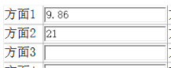

之后计算按钮，可得

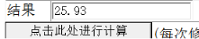

所以这样一个两个模式的效果的价格是25.93。

清除之前的填写的轻转换特性、转换特性、标准单特、非标准单特，将这些双模式中的效果整合为一个25.93的非标准单特填入即可。点击计算按钮后可得

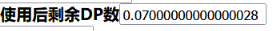

DP几乎全部使用，这样就完成了范例资源的撰写。

想要知道多方面规则是如何计算DP的，以及多方面还可以应用于哪些方面，请查看 撰写相关→多方面检定 。

# 关键点

1、直接购买DP转换中的第一部分和第二部分的效果需要用两种方式缴税

2、TMD中没有足够的指标作为门票，即使DP足够也不能购买通用特性表中对应的特性。

3、动作可以提升指标，并至多将指标提升一级。成长可以成长出比指标高一级的特性，二者结合可以获得高两级的特性，这就是极限了。

4、以上这些实际上是比较基础的撰写方法，如果想要更加自由的撰写，还是建议仔细阅读撰写相关中的所有规则。也欢迎来TMD推广群（681162982）里进行探讨。

# 个人建议

正如开头所说，范例资源虽然数据上没有问题，但因为购买方式生硬以及画风问题导致不能通过审核。根据我的个人经验，我建议你

1、做逃税大师，尽可能通过成长的方式逃掉3税1和单特税，直接购买加值实在是过于生硬了。

2、开始车资源时可以找个有原典的简单东西，我个人认为这种东西因为有原典所以在描述画风，设计效果时会方便一些。

3、如果陷入了画风与强度的抉择，别犹豫，选择画风就是了，帅才是一辈子的事。

4、不要把DP花在同一块地方，譬如所有的DP都用于购买攻击上的加值，即使使用了成长，也不容易过审，当然，也有例外就是了。

[档铺网——在线文档免费处理](http://www.docpe.com)