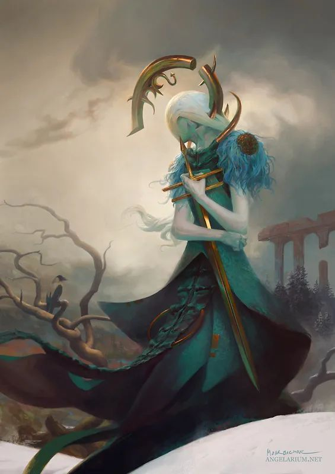

# 新秩序

<table class="bannerparthead"><tbody><tr id="hdr"><td class="runninghead" nowrap="">TMD：新秩序000</td></tr></tbody></table>

# 新秩序

  

你的手已经张开细致的拳  
让它们轻柔漂浮的手势淡去，  
你的双眼紧闭像两只灰色的羽翼，我跟随  
在后，任由你涌动起来的折叠的浪，将我  
带走。夜晚，世界，风织纺它们的命运。  
没有了你，我是你的梦，只是这样，不过如此。

TMD：新秩序是本规则书的第一个正式版本，在经历人员变动与内容更新后，终于可以为玩家提供几乎全套的基础规则与少量的资源内容以供游玩。本贴将作为此版本的主要索引贴持续更新更多leak与开发日志的链接。  
  
特别鸣谢技术指导与编撰者们对本规则书的奉献。

* * *

     Copyright © 2022 [TMDtrpg制作组](http://www.goddessfantasy.net/bbs/index.php?board=2008.0). All Rights Reserved.