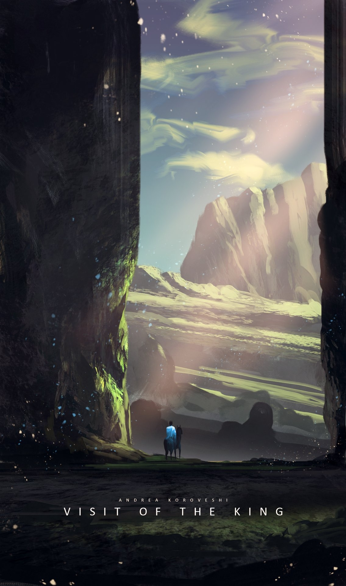

# 新世短歌

<table class="bannerparthead"><tbody><tr id="hdr"><td class="runninghead" nowrap="">TMD：新世短歌030</td></tr></tbody></table>

# 新世短歌

“长日尽处，  
我站在你面前。  
你将看到我的伤疤，  
知道我曾受伤，  
也曾痊愈。”

  

TMD：新世短歌（New Tanka）终于完成了它的历史使命，并于今日盖棺定论。或许还有很多歌未唱完，或许明天在明天就会到来。但无论如何，请满怀期待，The brave new world，What a wonderful world.  
特别鸣谢TMD所有玩家和为之完善努力的人们。  
特别鸣谢唱至嗓音沙哑的布谷鸟。  
特别鸣谢名为太阳的星星。

* * *

     Copyright ? 2025 [TMDtrpg制作组](http://www.goddessfantasy.net/bbs/index.php?board=2008.0). All Rights Reserved.