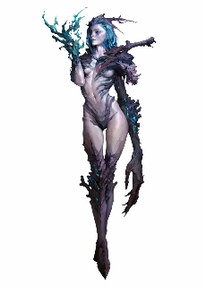
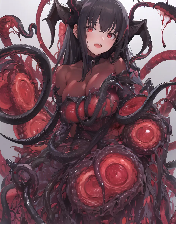
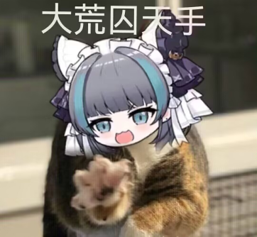

# 恋人的怪物手册

<

<table class="bannerparthead"><tbody><tr id="hdr"><td class="runninghead" nowrap="">TMD：汹涌疾风020</td></tr></tbody></table>

# 恋人的怪物手册

怪物手册

这个创作和书写是为了给广大萌新st一个标准的TMD车怪卡标准，一般来说老练的ST是不需要的，主打一个凭空生产怪卡（脑内），但作为一个萌新st，在多次争议下，还是看看以下内容，让团更加顺利的游玩。同样的，如果是老B登，也能看看。

首先我们得有一个最基础的模板，这个模板无论是什么位格的玩意都能适用，简称“tmd万能”

通用怪物模板：

根据主、副属性计算，对应如下：

给这些怪物分配2个主属性，2个副属性，其他4项皆为通常属性；有1个主技能，3个副技能，2个主专业，5个副专业，其他技能皆为1。

无支线：主属性为5，副属性为3，通常属性为1；主技能/专业为3，副技能/专业为1

D级：主属性为6，副属性为4，通常属性为2；主技能/专业为5，副技能/专业为3

C级：主属性为11，副属性为9，通常属性为6；主技能/专业为8，副技能/专业为5

B级：主属性为16，副属性为14，通常属性为11；主技能/专业为11，副技能/专业为8

A级：主属性为21，副属性为19，通常属性为16；主技能/专业为14，副技能/专业为11

S级：主属性为36，副属性为34，通常属性为31；主技能/专业为20，副技能/专业为17

S+XS级：主属性为36+XS×15，副属性为34+XS×15，通常属性为31+XS×15；主技能/专业为20+XS×6，副技能/专业为17+XS×5，X为额外S支线数量

在车怪的时候，要看看自己是什么团，普普通通的团？高难？高压？或者春游，有什么特点？

 下面的例子也只是单纯的普通战团数值参考，随时可以进行调整和削弱，按个人所需进行调整，希望大家都有良好的体验。

当然怪物也分位格，也就是简单的【杂鱼】【普通】【精英】【BOSS】，根据位格，我们来详细说说他们的额外作用和特性！同样的怪物不需要交税！（税务局管不到！）

【切记！！！！！】无论如何在车怪时，不要随意堆叠dp，这样只会让pl体验极差，比如：我车一个D杂鱼，我全部堆15+天防或者攻击，当然你也可以这样车，但一定要有弱点！这个弱点能被发现，或者能被剧情杀！还有一定要有特色！（特别色也行），或者因为团背景，或者剧本规则。

当然为了更好的体验，有一个不需要任何付出就能获得的怪特性，也是车怪必备的（除了个别人形生物），别问，问就是战斗！爽！

【不晕】不会因为拥有韧性伤害而晕厥。

其中【杂鱼】，一般来说是团中最拉胯的怪物，或者背景板，或者单纯凑数，又或者作为小弟簇拥老大出现，当然，如果你剧情圆满，在这种位格的怪物身上也能埋下不小的伏笔！

他们身体懦弱，他们成群结队，虽然无法对pl造成一定影响，甚至见面杀，但他们可以在某些情况下对pl造成一些阻碍，让整个团更具挑战性或者刺激性！

     杂鱼如果太多，如:杀人蜂群，丧尸群，骷髅兵团，都可以用集群出击（省时省力），在受到一定伤害后彻底死去，但攻击可以视为对某范围内所有人造成伤害。

【杂鱼】在通用怪物的模板上获得3点专长点（或者相同xp），可以没有武器，没有护甲（最高也只是白板），1-2个同级特性。

例子:

 

珊瑚女尸（无支线）

▓▓生理属性

■力量5

■敏捷3

■耐力5

▓▓心智属性

■智力1

■感知3

■决心1

▓▓互动属性

■风度1

■操控1

■沉着1

▓▓▓▓技能

▓▓生理系

■运动1\-反射1

■求生1-强韧1追踪1

■射击1

■武技3-牙3爪3

▓▓心智系

■学识1

■器用1

■手艺1

■专注1\-意志1

▓▓互动系

■洞察1侦查1

■隐秘1

■表达1

■社交1

▓▓▓▓衍生属性值

▓体积 5

▓速度13 米

▓先攻 rd10+4

▓防御 1

▓生命值 10

▓意志力池

▓意志3 

▓反射 5

▓强韧 7

▓侦查 5

▓敏感范围60 米

▓▓▓▓攻击预设：

普通攻击预设：力量+武技+牙+天武\=  14+1造成严重物理伤害

▓▓▓▓防御预设：

基础防御1

天防3

▓▓▓▓特性：

病毒感染：你只要攻击造成伤害，那么对方会获得1点感染度，达到100感染度，对方会变成丧尸，这视为一个D级特异来源的毒素。

珊瑚盔甲:额外获得3点天防。

尖牙利爪:你的牙和爪，视为3L的天生武器

特殊背景特性

不计算特性（同样的有致命的弱点或者剧情杀）:

【集群】丧尸群成群结队，他们如同浪潮，在10只以上组合起来的尸群，想彻底击散尸群需要造成耐力\*5点伤害，但每回合只能进行一次攻击，但可以作用于多个目标，同样的因为尸群汹涌，互相碰撞，移动速度下降5点，并且受到范围伤害翻倍，且无法豁免。

【普通】他们是一个副本的基石，和杂鱼一样多，也可能没有，但他们是pl的第一次敌人或者挑战，他们不再于成群结队出现，一般三三两两一队，又或者独自一人，他们是俗世中庸庸碌碌的大家伙。

他们的致命点在于平庸，并不突出，但在配合下也能对pl造成一定伤害。

其中一些诡异类型的本里面的普通怪物也有恐怖的机制杀。

【普通】在通用怪物的模板上，额外获得1个副属性，1个主技能，1个副技能，获得8点专长点（或者相同xp），可以拥有一把白板武器，白板护甲，2个同级特性。

例子:【以某个诡异本中的怪物为例】

花子（D级）

 

▓▓生理属性

■力量2

■敏捷4

■耐力2

▓▓心智属性

■智力6

■感知4

■决心6

▓▓互动属性

■风度2

■操控2

■沉着4

▓▓▓▓技能

▓▓生理系

■运动5-反射3

■求生3-强韧3

■射击1

■武技5-牙5爪5

▓▓心智系

■学识3-

■器用1

■手艺1

■专注3-意志3

▓▓互动系

■洞察3-侦查3察言观色3

■隐秘1

■表达1

■社交1

▓▓▓▓衍生属性值

▓体积4

▓速度 10米

▓先攻 8

▓防御 4

▓生命值 6

▓意志力池 12

▓意志 13+2

▓反射 12+2

▓强韧  8+1

▓侦查 10+1

▓敏感范围 80米

▓▓▓▓攻击预设：

普通攻击预设：决心+武技+牙\= 16+3造成严重物理伤害

传说触发后攻击预设:16+12=28+5  精神伤害

▓▓▓▓防御预设：

基础防御4

▓▓▓▓特性：

地缚灵:你视为灵体，你无法移动，在没有被召唤的情况下无法离开固定的厕所，同样的也无法进行攻击或者别的动作。

仪式召唤：在被召唤后，灵体效果消失，你可以进行攻击了，询问对方，有什么事？

1. 和我x爱

2. 我要杀死你

不论是暗示或者直接诉说，只要触发这两个条件的对话（大概意思）或者被人攻击，就能触发【传说】

传说:“在学校校舍3楼的厕所里，敲了3下门，‘花子在吗？’从最前面的单间到里面各做3次，第3个单间就会用微弱的声音回答“是”。打开那扇门，有一个穿着红色裙子的小娃娃头的女孩子就会把敲门的人拖进厕所做一些大人才能做的事情————你的攻击额外获得12点攻击检定增强加值和2点附加成功，同时你的伤害变为精神伤害，对方以强韧豁免该伤害。

【解脱】（特殊例子）:如果是一些诡异本里面的怪物强于单个pl，那么这种特性就很有必要的出现，比如他们需要找到这个“花子”仇人，带到其面前献祭或者杀死，就能直接解决这个怪物，这是为一种命运来源的S级即死效果。在没有解脱之前，花子不会真正的死亡，她会在三天后复活在原来的地方。

【精英】这个位格的怪物已经是独当一面啦，他们很多情况下，是BOSS战中的好帮手。一般来说他们足以一个人面对2个或者多个pl的围攻第一回合不死，相当于另一个特别的pl啦！这种怪物的特色就必须更加突出！

一般来说：是狩猎经验老道的猎人，是进队发展迅速的骑士，是从黄油哥布林巢穴杀出来的女狂战，是地牢中长年封闭的触手怪……

【精英】在通用怪物的模板上，额外获得1个副属性，1个主技能，1个副技能，获得8点专长点（或者相同xp），可以拥有一把同级武器或者护甲，3个同级特性。

例子:

 

触手娘

▓▓▓▓属性

▓▓生理属性

■力量11

■敏捷9

■耐力11

▓▓心智属性

■智力6

■感知9

■决心6

▓▓互动属性

■风度6

■操控6

■沉着6

▓▓▓▓技能

▓▓生理系

■运动\-5反射5-投掷5

■求生5-强韧5

■射击1

■武技8-触手8

▓▓心智系

■学识8-魔法8

■器用1

■手艺1

■专注5-意志5

▓▓互动系

■洞察5侦查5

■隐秘1

■表达1

■社交1

▓▓▓▓衍生属性值

▓体积 6

▓速度 34米

▓先攻 15（2d10）

▓防御 9

▓生命值 27

▓意志力池 14

▓意志 19+3

▓反射 17+3

▓强韧 27+3

▓侦查 17+3

▓敏感范围 200

▓▓▓▓攻击预设：

普通攻击预设：力量11+武技8+触手8+武器11+风度全检定1+扭曲汲取6= 45+4造成严重物理伤害   9高速1破甲

普通投掷（临时武器）预设:力量+运动+投掷+临时武器？\=22-？点严重伤害，距离大约是55米

乱舞预设:力量+学识+魔法+武器+风+扭曲汲取\=45+4

▓▓▓▓防御预设：

基础防御9+1

闪避4

天防5

▓▓▓▓特性：

【灵活触手（同等级武器）】:你的触手视为特殊的武器，同时，它使用的攻击专业是武技下的触手专业。

触手基本属性：武器伤害11L，破甲1

触手特殊属性：【轻灵】

迅速：仿若刹那的一击，生死只在一瞬之间。

以该武器进行攻击，可以在攻击前与对方进行纯敏捷检定对抗，若对抗成功，则本次攻击取得自身敏捷\*1点高速。

汲取：触手那是断送生命的武器，而并非引导他人的武器。

因此，使用触手的攻击将附带等同持有者传奇力量/2点韧性伤害。

魔物体魄:获得等于耐力一半的强韧豁免加值。

扭曲汲取：你的额外获得6点攻击加值，同时你的攻击具有【吸血1】

滑溜体液（白板护甲）:额外获得4点闪避防御，以及5点天防护甲。

色欲乱舞:对周围30米内所有目标进行一次力量+学识+魔法攻击，这次攻击目标需要以反射来对抗，同时这次攻击不会造成伤害，而是造成等同于此次伤害的纠缠，一旦纠缠进入定身状态，那么被束缚者会被触手汲取生命能量，每回合受到自身耐力/2点严重伤害，直到被榨干。

【BOSS】，这个位格的怪物，可是具有代表性的，他们或许隐居幕后，又或者早期就跳出镇压或者横扫一切，他们是世界的宠儿，是天之骄子，是种族的领导者或者最特殊的那一类人群。

同样的，BOSS的方式是不固定的，他们拥有的特性一定一定一定要最有特色，并且他们是拥有独立的设定，切莫把精英那一套搬来。

一般来说，BOSS们有可能会弱不禁风，但他们的一些举动足以让pl难受至极，又或者强如战神，令pl们感到绝望，所以模板并不固定，但为了区分，我还是列出一个标准的数值模板，但例子，我将采取弱不禁风那种来进行演示。

【BOSS】在通用怪物的模板上，额外获得1个副属性，1个主技能，1个副技能，获得8点专长点（或者相同xp），可以拥有一件高一级的武器装备和一把同级武器或者护甲，如果是略有挑战性的副本还可以配备一件同级奇物，5个同级特性（特性部分其实可以忽略不计，一定要有特色，不是无敌即可）。

 

可爱的柴郡猫猫（C本BOSS）

▓▓▓▓基本能力值

▓智力 6

▓感知 6

▓决心 16

▓力量 6

▓敏捷 6

▓耐力 6

▓风度 11

▓操控 6

▓沉着 11

▓▓▓▓技能

▓知识1

▓器用1

▓手艺1

▓专注8 意志8

▓运动8 反射8

▓生存8 强韧8

▓射击1

▓武技8 拳8

▓洞察8 搜查8

▓隐秘1

▓表达8 卖萌8

▓社交8 喵言喵语8

▓▓▓▓衍生属性值

▓相貌:15

▓体积2

▓速度 57

▓先攻 17（3d6）

▓防御

基础 6+1

▓生命值 14

▓意志力池 33

▓意志 35+6

▓反射 23+4/34+5

▓强韧 23+4

▓搜查 24+4

▓敏感范围 140米

▓▓▓▓攻击预设：

大荒囚喵手！预设：风度+武技+拳+相貌+传奇风\=43

▓▓▓▓防御预设：

基础防御6+1

闪避11+2（移动后）

▓▓▓▓特性：

可爱猫猫！:你平时状态为一只可爱的猫猫，所有人面对你的第一眼好感度提升一级，并且对你第一次攻击毫无戒心！第一回合攻击视为B级措手不及。

喵喵喵！:你可以随意跟50米内任意人物进行心灵交流，同样的他们不会因此感到奇怪，同样的你的互动性技能获得9加骰。

我是可爱喵喵:你可以标准动作对一个目标进行一次风度社交喵言喵语检定，这类似于说服，只要有1成功数，只要不违背对方基本道德和伤害自身的，他们都会帮你完成你的意愿，达到15就需要进行一次具有8减值的意志豁免，如果豁免失败则被你支配一回合。这是为一个心灵来源的B级支配效果，你每成功控制一个人一次，你的相貌就永远+1。

大荒囚喵手！:你可以伸出毛茸茸的爪子对前方一个目标进行打击，这次攻击运用风度+武技/表达+拳/卖萌+相貌值，如果是武技则对抗对方强韧，如果是表达，则是对抗意志，对方受到差值精神伤害。视觉上表达为，你让对方流鼻血倒下或者被你可爱到了！

身手狡黠:你移速增加30米，并且只要移动过就能拥有11+2点闪避防御和相等的反射豁免。

如果你有一些装备可以爆出来给pl，记得把装备加值也写在BOSS卡上哦。

最后结言:感谢高达的数值计算，这个手册只是为了让大家伙更加容易车怪卡，不是指导和规定哦，请大家安心游玩吧。

     Copyright ? 2022 [TMDtrpg制作组](http://www.goddessfantasy.net/bbs/index.php?board=2008.0). All Rights Reserved.